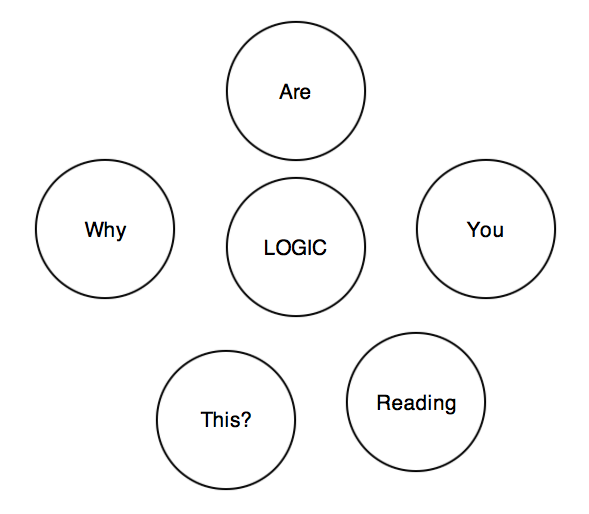

====================================
How to release software periodically
====================================

:author: Grzegorz Adam Hankiewicz
:department: Software releases
:location: Spain, Colmenar Viejo, 28770
:contact: melissavirusiloveyou@gradha.imap.cc
:adult rating: not safe for work (NSFW)

.. header::

    ###Title###

.. footer::

    Page ###Page###

.. section-numbering::

ABSTRACT
========

We explain the perils and hiccups of existing software development both
professionally and in amateur circles with regards to software releases.
Software releases can be tamed and we propose a method which can be applied to
most software. We demonstrate how different projects stored in GitHub
[#githubb]_ compare and how they can improve. We dislike Bitbucket [#bitbucket]_
and therefore don't say much about them. We also talk in plural form despite us
being a single being, hopefully not because we suffer from schizophrenia or
delusions of grandeur; also we use semicolons whenever we feel like it and try
to concatenate word after word to create long enough sentences that not even a
professional Opera singer could say out loud in a single breath despite not
saying much at all; maybe.

Keywords
--------

9muses
Nimrod
alcohol
babel
bike
dvcs
github
kpop
metal
nsfw
pdf
politics
rant
rst
shedding
snsd
swearing

INTRODUCTION
============

Releasing software once is simple; even an underage monkey trained in Ruby
[#ruby]_ or Python [#python]_ can access GitHub and upload anything, therefore
giving the impression of being hipster, but the question is how to follow the
initial release. In particular, there are many trained monkeys uploading
software to repositories seemingly at random and then leaving them to wither
without subsequent changes.  Individual talks [#nsa]_ with a non significant
statistically group of developers suggested the main reasons for the halting of
the development was a lack of defined guidelines for software releases,
troubles handling distributed version control systems, missing leadership,
insufficient contact information for potential contributors and feature creep
among others.  We leave other bus related [#bus]_ arguments out of the equation
as we are interested only in the situations where the will is there, but it is
obstructed by something else.

Troubles handling distributed version control systems
-----------------------------------------------------

Bitbucket sucks [#bbsucks]_, so we will ignore it and talk only about GitHub
which is super cool. As many of the world's developers woke up from the
prehistory of zip files and maybe CVS [#cvs]_ or Subversion [#subversion]_
directly into the bright and sparkling world of git [#git]_, the transition was
less than ideal and we have found many of the cro-magnon developers kept using
their methodologies (or rather lack of any formal methodology) for… ever.
Despite git being a distributed version control system allowing individuals to
create peer to peer micro networks, the social nature of humans forces them to
stick all together like a pile of excrement to a single known server, because
God forbid anybody have a different opinion.  Hence GitHub [#githubb]_.

Branches are a much appreciated feature of git and other distributed version
control systems, but developers mostly talk about branches in future tense
without ever using them because, fuck it, why should they bother in the first
place when you can put everything in *master*.

As such, the best practice of creating a branch per feature of the software is
usually neglected and the *master* branch of git used as a recycle bin, with
software stability hopefully drawing a sinusoid function between official
release versions (but no guarantees on that). There is no exit from this pit of
despair, and we understand that developers who fall through it actually reach
one of the Circles of Hell in life [#hell]_.

A little education of the tools you use every day can go a long way. Even
learning to read is hard, but you are reading this; can't you see how much you
have already won? So go ahead and try reading some git documentation
[#progit]_, it can only help.

Poor or wrong contact information
---------------------------------

Open source projects tout themselves as having the potential of attracting
anybody and allowing them to contribute. But every software project is
different and requires a different approach to contributions. Some projects
require contributors to create issues or follow a coding style [#style]_ while
others require their users to write documents and publish them [#pep]_, which
both informs and serves as a roadmap.

Potential contributors find the lack of instructions or guidelines for
contribution as a hurdle. There is always the fear that Murphy [#murphy]_
will make your contribution, no matter how useful, linger in a special
developer limbo because you forgot to tag the issue correctly or didn't
explicitly address one of the developers with commit rights to the repository.

Missing leadership
------------------

There are many repositories [#sharekitrepo]_ which at some point *stall*
development because its authors don't accept pull requests and Google still
points to their fork despite others being more advanced. Sometimes a note like
"*sorry, went out for coffee, will never be back*" could give ideas to the
contributors that the selected fork is a dead end, but people don't want to be
nice to each other, and therefore we can't have nice things [#medicaidd]_. In a
few rare cases the community can pick up dead projects and fork
[#sharekitissue]_ them successfully, but this requires a lot of mass to
succeed, something which starts to be feasible when the number of active and
maintained forks is greater than four [#xkcdd]_.

A variant of this phenomena is the Ivory Tower Developer who once every two
moons graces the mortal population with a visit, saying few words to some
selected developers and leaving the rest wondering what have they done in this,
or their previous life, to not be worthy. According to our measurements
[#measurements]_ most thin skinned contributors are effectively dissuaded from
the project and never come back, since they happen to fall somewhere in the
middle between full moons and see no activity.

Even active projects with several developers with commit rights are not safe if
there is no strict guideline on who does what. As such, if a pull request or
issue falls *between boundaries* of these developers, the time to address the
pull request or issue grows exponentially with the number of overlapping
developers (see Figure 1).

    **Figure 1**. Venn diagram.
    We don't understand either.

Feature creep
-------------

Enough is enough. But people sometimes forget how much of enough is enough, and
keep adding without consideration. Instead of finishing fixing minor bugs, new
incomplete features are added to a project preventing it from ever reaching a
*stable* state. Combined with the lack of branches of most projects even
newcomers to a project will check out a repository and never get it working,
most of them leaving at that point to watch pictures of cats that look like
Hitler [#kitlers]_ being posted on the internet.

Feature creep is usually attributed to lack of focus. Lack of an updated task
list (aka vague TODO last updated two years ago), hundreds of issues piling up,
or mentions of heavy use of alcohol in forums or irc channels are indicators of
this. You are a firefly and get distracted by shiny new things; we understand.

GIT-FLOW, SAVIOUR OF THE WORLD
==============================

Git-flow [#gitflow1]_ is a software solution which can help with some of the
enumerated problems. It is essentially gratuitous bureaucracy applied to
software development. At the mere mention of bureaucracy most developers flee
leaving a trail of screams and pulled out hair. However, git-flow automates
that bureaucracy to the bare minimum, enforcing a practical guideline
[#gitflow2]_ to develop.  Nothing from the points described below actually
require git-flow; it is just a bunch of scripts to deal with the bureaucracy.

Git-flow has a good base documentation and plenty of fans have extended it
[#gitflow3]_.  This paper only highlights *why* it works, and how it solves the
problems software developers have.

Master is not the master any more?
----------------------------------

The first big change of how git-flow works is that by default it considers the
*master* branch to be stable. And rightly so: a newcomer to a project may want
to clone the repo and compile it. Since the default branch is *master*, it is
best if it is stable and compiles without issues. Hence, a secondary branch
named *develop* is created, where the actual commit and merge orgy happens.

When the developers consider that the contents of *develop* should be made
public, they can merge that branch with master. Git-flow will also tag the
source tree at that point with a version number and a message. Tags are
automatically understood by hosts like GitHub as software release points [#qlreleases]_, and
it is very easy to create software releases from them.

Through this simple change an easy pattern is established: any branch merged
with master means a *public* change is done. During normal development these
public changes will mean normal bug free development.

Hotfixes
--------

Things go south. You know this if you are a developer. And to fix them,
*hotfixes* [#engineer]_ are issued. Sometimes a bug might be too embarrassing to leave out
there, or it involves the pride of your employer's son. Whatever the reason,
your normal development cycle is not fast enough and you have to stop whatever
you were happily doing in *develop* and fix *master* instead.

For these situations you start with git-flow a *hotfix* branch based on
*master*. In this branch you commit everything needed to make the software work
again and save countless puppies. Once the hotfix is finished, git-flow will
merge it against *master*, but it will also merge it against *develop*. This is
very handy in the case where the fix involves new code; the scripts make sure
it is applied in both places.

In the case of the hotfix involving applying code already found in the
*develop* branch because the political nature of the bug escalated (eg. known
crash which somebody figures how to obtain Scarlett Johansson private pictures
[#scarlett]_) you can simply cherry pick changes from the *develop* branch.
Those will be merged into master, and the automatic merge into *develop* again
will make sure that when your normal development cycle reaches the release
state git won't complain about duplicate stuff.

Sub develop branches
--------------------

The same process created around the master and develop branches can be reused
recursively for the purpose of clearly limiting feature creep for each release.
Moving development to a *develop* branch doesn't magically avoid feature creep.
If the next software release has to have features ``A``, ``B``, ``C`` and you
can't wait to implement ``D``, simply create another branch, maybe
*develop-future* where you add these changes. This split avoids that ``A``,
``B``, and ``C`` are eventually solved, but the *develop* branch can't be
merged into *master* because it contains an incomplete ``D``, or worse, is left
unstable. If you can't be arsed to finish the tasks required for the stable
release, at least don't get in the way of others implementing then.

This goes well also with periodical public releases. The old Vulcan [#vulcan]_
saying "*Release early, release often*" is usually ignored in its second part,
because most people try to avoid planning. Every three months in your
development, decide what features are enough to make a stable release and keep
*develop* only for them. Wow, we just rediscovered Debian's stable, testing
and unstable distributions [#debiann]_ but using branches. Aren't we clever?
This has been demonstrated to work for ages. Any of your arguments against this
subdivision is invalid unless you prove that your software is more complex than
an operative system with thousands of interdependent packages who has lived for
longer than two decades [#debian2]_.

NON TECHNOLOGICAL SOLUTIONS
===========================

Git-flow is a technical aid to the bureaucracy problem. Some of the problems we
have mentioned don't have a clear software solution. We ask the community for
feedback on how to deal with them and propose our own.

Necessary documentation
-----------------------

The disadvantage of using git-flow (or just about anything else other than
piling commits recklessly on *master*) is that it requires documentation. The
number of bureaucratic developers is still outweighed by the hordes of
senseless commit-happy hackers. As such, these hackers will clash with the
process unless it is clearly documented.

The bare minimum is mentioning that you use a specific kind of process for
software development. Mentioning git-flow and linking to it may be enough, but
try to clearly mention that contributions are to be made from a specific branch
(*develop*); it can be frustrating for a contributor to have his work rejected
because he based it on the wrong branch.

Clear task domain division
--------------------------

The solution to the missing leadership in the case of multiple developers with
commit rights can be solved through a simple wiki page modified by all of them.
Initially this wiki page can start with the repo owner, and from then on each
new member can be listed there. The project needs to subdivide itself in
manageable tasks, for instance: documentation, online support (forums, irc,
twitter, issues, etc. further subdivided if necessary), web design and updates,
software quality (also known as continuous integration), core development,
additional tools, etc.

These subdivisions can start small: if a project features just three people it
may be unnecessary to subdivide the domain in more than three chunks if each
people's task overlap. Then as people are added, the list can be refined.

As people enter a team, they should be placed on a task with an explicit
*supervisor*. This would be a person who verifies the work of the supervised.
Initially the changes done by the new members should all be approved by the
supervisor. Once the supervisor considers enough training has been done, the
supervisor is still assigned but allows the new member to work directly. The
assignment serves for the purpose of resolving strange conflicts, and the new
member still knows whom to ask for help if needed.

Communication is an important factor to help this succeed. When a new member is
in the early learning stage, he should always *ping* the supervisor when the
task is meant to be reviewed. As such, if a GitHub issue is seen by the new
member and marked as ready, the supervisor can directly apply the changes.
Also, a *dispatcher* can be assigned to decide who does what, which is usually
best left to the original developer or whoever has the most knowhow of the
project.

Locked feature lists
--------------------

Nobody knows better when a release needs to be made than the project's
developers. However, there is always the temptation to add *just a little bit
more* to the next release, and so, never finish.

In a similar fashion to the clear task domain division, another wiki page can
hold the list of tasks that need to be done for a specific release. But rather
than being modifiable by anybody, this page should be touched only by the
person in charge of the project. Changes to the list should be discussed as a
group and weighted over: how does this new task impact the release schedule? Is
the new schedule delayed by how much? Should we delay some tasks from the
feature list to compensate?

Note again that this doesn't *prevent* developers from working on future
developments since they can use many other branches other than *master* or
*develop* (branches are free). The main goal here is making sure everybody
knows **when** the software is going to be released, and **what** has to be
done to do so. When both of these are known, even random occasional
contributors can step in and help with the release. But when the next release
is *whenever it is ready* or long overdue, how are contributors meant to help
with that?

CONCLUSION
==========

1. Use git-flow [#gitflow1]_. It may feel like a corset in the beginning,
   slightly constraining, but corsets can be sexy too [#kang]_.

2. Don't watch too many Youtube videos [#youtube]_.

3. Program in Nimrod [#nimrod]_ FTW.

ACKNOWLEDGEMENTS
----------------

Thanks to Andreas Rumpf for making Nimrod [#nimrod]_.

Thanks to 9muses for endless inspiration [#9muses]_.

Thanks to GitHub for hosting this paper.

.. raw:: pdf

    PageBreak oneColumn

REFERENCES
==========

.. [#githubb] `GitHub <https://github.com>`_.

.. [#bitbucket] `Atlassian Bitbucket <https://bitbucket.org>`_.

.. [#ruby] `Ruby, a programmer's best friend <http://www.ruby-lang.org/>`_.

.. [#python] `Python Programming Language <http://www.python.org>`_.

.. [#nsa] See `NSA archives <http://www.nsa.gov>`_ for the recorded
    conversations.

.. [#bus] `What if Linus Torvalds Gets Hit By A Bus?
    <http://www.crummy.com/writing/segfault.org/Bus.html>`_

.. [#bbsucks] `Spooning by Bitbucket <https://bitbucket.org/spooning/>`_.

.. [#cvs] `Concurrent Versions System <http://www.nongnu.org/cvs/>`_.

.. [#subversion] `Apache™ Subversion®, Enterprise-class centralized version
    control for the masses <https://subversion.apache.org>`_.

.. [#git] `git --distributed-is-the-new-centralized <http://git-scm.com>`_.

.. [#hell] `Infero, by Dante Alighieri at Wikipedia
    <https://en.wikipedia.org/wiki/Circles_of_hell>`_.

.. [#progit] `Pro Git, by Scott Chacon <http://git-scm.com/book>`_.

.. [#style] `OpenJPEG library coding style
    <http://code.google.com/p/openjpeg/wiki/CodingStyle>`_.

.. [#pep] `PEP 404, Python 2.8 Un-release Schedule
    <http://www.python.org/dev/peps/pep-0404/>`_ vs `Why do Projects Support
    old Python Releases
    <http://gregoryszorc.com/blog/2014/01/08/why-do-projects-support-old-python-releases/>`_.

.. [#murphy] `Murphy's law at Wikipedia
    <https://en.wikipedia.org/wiki/Murphy's_law>`_.

.. [#sharekitrepo] `ShareKit <https://github.com/ideashower/ShareKit>`_.

.. [#medicaidd] `Medicaid at Wikipedia
    <https://en.wikipedia.org/wiki/Medicaid>`_.

.. [#sharekitissue] `SHAREKIT 2.0 – ONE MAIN GLOBAL FORK
    <https://github.com/ideashower/ShareKit/issues/283>`_.

.. [#xkcdd] `XKCD 221: Random Number <http://www.xkcd.com/221/>`_.

.. [#measurements] Vague mentions like *"Oh, I thought the project was dead*"
    read on IRC channels.

.. [#kitlers] `Cats that look like Hitler
    <http://www.catsthatlooklikehitler.com/>`_.

.. [#gitflow1] `Git extensions to provide high-level repository operations for
    Vincent Driessen's branching model <https://github.com/nvie/gitflow>`_.

.. [#gitflow2] `A successful Git branching model
    <http://nvie.com/posts/a-successful-git-branching-model/>`_.

.. [#gitflow3] `git-flow-cheatsheet
    <http://danielkummer.github.io/git-flow-cheatsheet/>`_.

.. [#qlreleases] `QuickLook render plugin for ReST (ReStructuredText) files.
    Releases/Tags
    <https://github.com/gradha/quicklook-rest-with-nimrod/releases>`_

.. [#engineer] `Trust me, i'm an engineer !
    <https://www.youtube.com/watch?v=rp8hvyjZWHs>`_

.. [#scarlett] `Scarlett Johannson Nude Cell Phone Pics
    <http://www.kineda.com/scarlett-johannson-nude-cell-phone-pics/>`_.

.. [#vulcan] `Vulcan (mythology) at Wikipedia
    <https://en.wikipedia.org/wiki/Vulcan_(mythology)>`_.

.. [#debiann] `The Debian GNU/Linux FAQ Chapter 6
    <http://www.debian.org/doc/manuals/debian-faq/ch-ftparchives>`_.

.. [#debian2] `Debian at Wikipedia <https://en.wikipedia.org/wiki/Debian>`_.

.. [#kang] Kang YeBin
    `1 <http://gonlamperouge.tumblr.com/post/72596775395/kang-yebin-everything-else>`_,
    `2 <http://gonlamperouge.tumblr.com/post/72596798308/kang-yebin-everything-else-part-2>`_,
    `3 <http://gonlamperouge.tumblr.com/post/72703822054/kang-yebin-everything-else-part-3>`_,
    `4 <http://gonlamperouge.tumblr.com/post/72704022967/kang-yebin-everything-else-part-4>`_,
    `5 <http://gonlamperouge.tumblr.com/post/72704104411/kang-yebin-everything-else-part-5>`_,
    `6 <http://gonlamperouge.tumblr.com/post/72704202502/kang-yebin-everything-else-part-6>`_ and
    `7 <http://gonlamperouge.tumblr.com/post/72813406443/kang-yebin-everything-else-part-7-final>`_. Whew!

.. [#youtube] `Nine Muses Youtube channel
    <https://www.youtube.com/user/NineMusesCh/videos>`_.

.. [#nimrod] `Nimrod programming language <http://nimrod-lang.org>`_.

.. [#9muses] `131214 9muses - Glue performance
    <http://www.youtube.com/watch?v=dEf4PJZXBxA>`_.
